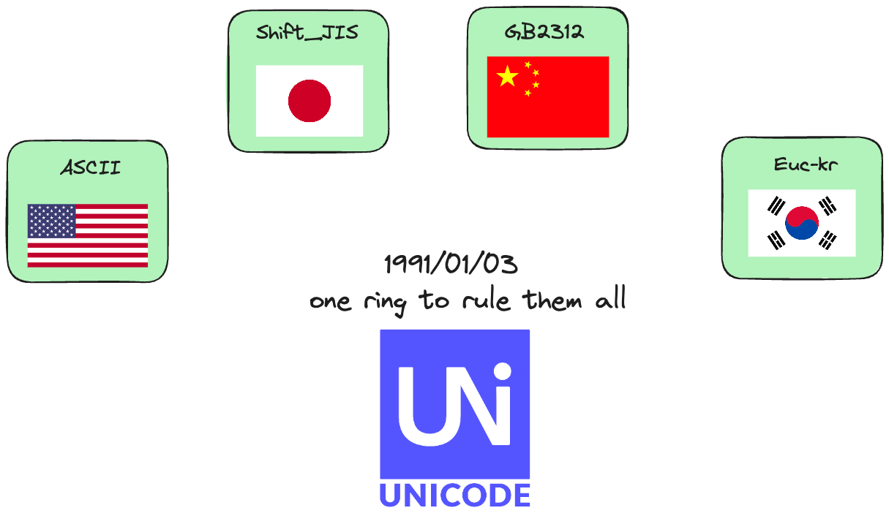

# String Fundamentals

> String (字符串)，是由字符拼接而成的finite sequence, 也是一种数据类型. Immutable object. 一般记为$s =a_{0}a_{1}\ldots a_{n-1} \quad(0\le n < n)$


## 字符串的编码

> 字符串的编码是指将字符串转换为二进制的过程。常见的编码方式有ASCII, Unicode, UTF-8, UTF-16等。

需要理解这一章是因为接下来的字符串比较问题，都是基于字符串的编码来进行的。对于numbers, 我们intuitive的理解`2>1`，计算机比较2进制怎么样，我们可以完全不在乎。但`汉堡>薯条` and `zeb vs abc`你怎么直观的比? 所以得dig into the encoding of string.

计算机处理数字的时候，是直接比较二进制的大小。如果我们想做任何`text processing`, 必须先把text -> binary. 这就是为什么我们需要了解字符串的编码。由于最早计算机是由美国发明的，刚发明的第一代，只有127个字符, 只放了一些alphabet `a-z`, `A-Z`一些数字和符号。这个编码叫做ASCII, 其中`A`的编码是`65`, `a`的编码是`97`. ASCII码只用1 byte = 8 bits = $2^8$ = `0-255`

然后面临着两个问题, 

- 随着需求，需要不断的扩展字符集. ASCII用1 byte表达是不够用的
- 不同国家有不同的字符集，比如中文，日文，韩文等。每个人都开发了自己的编码系统，中文`GB2312`, 韩文`Euc-kr`, 日文`Shift-JIS`. 这样就导致了不同的编码系统之间的不兼容。这也是我们小时候玩游戏看到乱码的原因。

为了解决这两个问题, one code to rule them all, `unicode`应运而生，把所有的语言统一到一套编码里的. Unicode不断在进化，常见的有`UCS-16`, 需要2个字节. 表达很生僻的符号，需要用`UCS-32`, 占据4个字节.

横向比较ASCII的1 byte, Unicode's UCS-16的2 bytes, 你会发现极大的储存空间浪费。我们拿`A`作比方, 

|字符|ASCII|Unicode|UTF-8|
|---|---|---|---|
|A|01000001|00000000 01000001|01000001|

你会发现`A`在ASCII转化到Unicode的时候，前面多了8个left padding zeros. 因为浪费空间，所以可变长的编码方式`UTF-8`应运而生。UTF-8是一种变长的编码方式，它可以用1-4个bytes来表示一个字符。对于英文字符，UTF-8编码和ASCII编码是一样的。所以UTF-8兼容ASCII. 综上所示，发展史如下,



具体工作的时候，不管你是用word,还是用python `with open()`, 都是将储存于硬盘的UTF-8转化为unicode进行编辑和操作，然后再转化为UTF-8存储. 同理，你在浏览网页的时候发现，server端网页的源代码是UTF-8, 但是你在浏览器(浏览器也是word)上看到的是转化为unicode后的, 如下图所示


总结一下, 

- encoding是为了text processing和储存而服务的. 我们学习了它的发展史，和为什么需要.
- UTF-8的存在是为了解决unicode的空间浪费问题的短板, 还兼容ASCII, 节省下来的空间大大提高了存储efficiency和网络上的传输效率.


## 字符串的比较

学习了编码，就可以理解string比较了. 两个字符串`str1` and `str2`如果相等的充要条件是:

- 字符串长度相等
- 对应位置的字符相等

比较两个字符串如下，

- from index $i$ where $i \in \left[0,n-1\right]$, 挨个比较字符
    - 如果`str1[i] == str2[i]`, 继续比较下一个字符
    - 如果`str1[i] < str2[i]`, 则`str1` < `str2`, 比如`abc` < `abd`
    - 如果`str1[i] > str2[i]`, 则`str1` > `str2`, 比如`abz` > `aby`
- 如果比较到，最后一个字符，其中一个字符串已经结束了，另一个字符串还有字符，那么长度长的字符串大. 比如`abc` < `abcd`.
    - 如果`str1`结束了，`str2`还有字符，那么`str1` < `str2`, 比如`abc` < `abcd`.
- 如果比较到，最后一个字符，两个字符串都结束了，那么两个字符串相等. 比如`abc` == `abc`.

??? tip "[ASCII](http://sticksandstones.kstrom.com/appen.html)"
    A-Z: 65-90, a-z: 97-122. 大写在小写前面.

由以上规则，我们可以design a `strcmp` method, 如下，

- 如果`str1` < `str2`, 返回-1
- 如果`str1` == `str2`, 返回0
- 如果`str1` > `str2`, 返回1

```python
def strcmp(str1, str2):
    index1, index2 = 0, 0
    while index1 < len(str1) and index2 < len(str2):
        if ord(str1[index1]) == ord(str2[index2]):
            index1 += 1
            index2 += 1
        elif ord(str1[index1]) < ord(str2[index2]):
            return -1
        else:
            return 1
    
    if len(str1) < len(str2):
        return -1
    elif len(str1) > len(str2):
        return 1
    else:
        return 0
```


## Reference

- [算法通关手册](https://algo.itcharge.cn/06.String/01.String-Basic/01.String-Basic/#_3-2-%E5%AD%97%E7%AC%A6%E4%B8%B2%E7%9A%84%E9%93%BE%E5%BC%8F%E5%AD%98%E5%82%A8%E7%BB%93%E6%9E%84)
