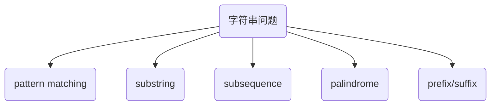

# String

> String (字符串)，是由字符拼接而成的finite sequence。Immutable object. 一般记为$s =a_{0}a_{1}\ldots a_{n-1} \quad(0\le n < n)$

## 常见问题

这一章在介绍完基础知识后，会根据常见问题分类讲解：

一些主要的会接触到的术语如下,

- `Null String`: 空字符串，长度为0
- `主串`: 原始字符串, $s = a_{0}a_{1}\ldots a_{n-1} \quad(0\le n < n)$
- `substring`: 在字符串中任意个**连续的**字符串所组成后叫做substring, 表达为$s[i\ldots j]$ where $0\le i \le j < ns$. 其中有两个特殊的子串，`prefix` and `suffix`
    - `prefix`: 以index 0开始的substring, 长度为k. 如`abc` is a prefix for `abcde`
    - `suffix`: 以index n-1开始的substring, 长度为k. 如`cde` is a suffix for `abcde`
- `palindrome`: 回文串，即正读和反读都一样的字符串。如`abba`, `abcba`

之后我们会对这些问题细讲.

