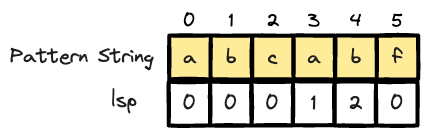
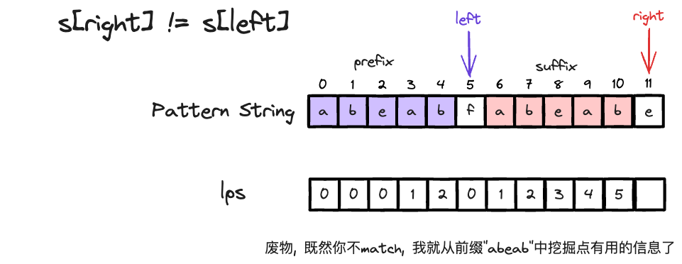
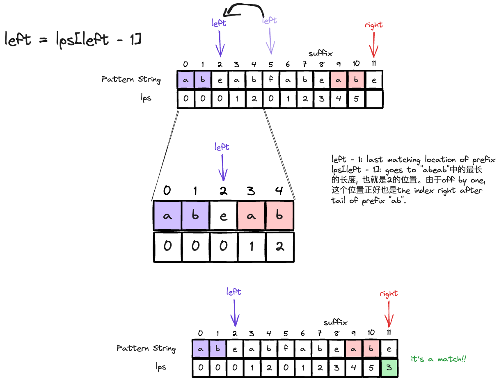

# KMP

> KMP是一个高效的字符串匹配算法，它的时间复杂度是O(m+n)，其中m是pattern的长度，n是text的长度. 

KMP有两个难点，

- 如何理解`next`数组，以及如何生成`next`数组.
- 如何利用`next`数组来优化匹配过程


## 生成next数组

> next数组，也叫longest prefix suffix (lps) 数组，是基于pattern string生成的一个数组，用来帮助我们在匹配的时候，跳过一些不必要的比较. 
> 
> `lps[i]`的定义为: 从index 0到index i的子串中，最长且相等的**从0开始的前缀**和**后缀ending in i**. 

!!! warning "前后缀定义"
    - 前缀：不包括最后一个字符的所有以**第一个字符开头**的所有字符
    - 后缀：不包括第一个字符的所有以**最后一个字符结尾**的所有字符

举个例子, 



|substring|lps|prefix|suffix|
|-|-|-|-|
|"a"|0|||
|"ab"|0|||
|"abc"|0|||
|"abca"|1|"a"|"a"|
|"abcab"|2|"ab"|"ab"|
|"abcabf"|0|||

现在我们initialize two pointers, `left` and `right`, `left`指向前缀串的tail位置，`right`指向后缀串的head位置. 以此, 

- initial condition, `left = 0`, `right = 1`, 生成`lps` of length $m$ of 0.
- `right`指针(后缀串的开始位置), 从1开始遍历 (right = 0肯定为0)


!!! warning
    记住left指针永远指向前缀串的tail位置，right指针永远指向后缀串的head位置. 


代码如下

```python
def generate_lps(p: str):
    # 初始化数组元素全部为 0
    m = len(p)
    lps = [0 for _ in range(m)]                
    
    # left always at tail of prefix, right 表示head of suffix所在的下标位置
    left = 0                                    
    for right in range(1, m):                   
        while left > 0 and p[left] != p[right]:
            # 匹配不成功, left进行回退, left == 0 时停止回退
            left = lps[left - 1]
            # left 进行回退操作
        if p[left] == p[right]:
            # 匹配成功，找到相同的前后缀，先让 left += 1，此时 left 为前缀长度
            left += 1
            lps[right] = left
        else:
            # 记录前缀长度，更新 next[right], 结束本次循环, right += 1
            lps[right] = left

    return lps
```

### FAQ 1: 为什么要这么退回left指针？

> Q: 为什么不想等，就退回left指针且，到0就停止回退。回退条件还是`left = lps[left-1]`？

举个例子,



123



## 利用next数组进行匹配

```python
# KMP 匹配算法，T 为文本串，p 为模式串
def kmp(T: str, p: str) -> int:
    n, m = len(T), len(p)
    
    # 生成 next 数组
    next = generate_lps(p)                      
    
    # j 为模式串中当前匹配的位置, i 为文本串中当前匹配的位置, i从不回退, j会根据next数组回退
    j = 0
    for i in range(n):
        # 如果模式串前缀匹配不成功, 将模式串进行回退, j == 0 时停止回退
        while j > 0 and T[i] != p[j]:
            j = next[j - 1]
        # 当前模式串前缀匹配成功，令 j += 1，继续匹配
        if T[i] == p[j]:
            j += 1
        # 当前模式串完全匹配成功，走到模式串的tail了, return 匹配的起始index
        if j == m:
            return i - j + 1
    # 匹配失败，返回 -1
    return -1
```


## 相关题目

- 26 implement strstr and solution here

## Reference

- [Abdul,适合理解KMP concept](https://www.youtube.com/watch?v=V5-7GzOfADQ&ab_channel=AbdulBari)
- [KMP by Neetcode, 看前15分钟即可，这时候思路还不清晰](https://www.youtube.com/watch?v=JoF0Z7nVSrA&ab_channel=NeetCode)
- [LC CHN 理解next数组是怎么生成的](https://leetcode.cn/problems/find-the-index-of-the-first-occurrence-in-a-string/solutions/1119642/duo-tu-yu-jing-xiang-jie-kmp-suan-fa-by-w3c9c/)