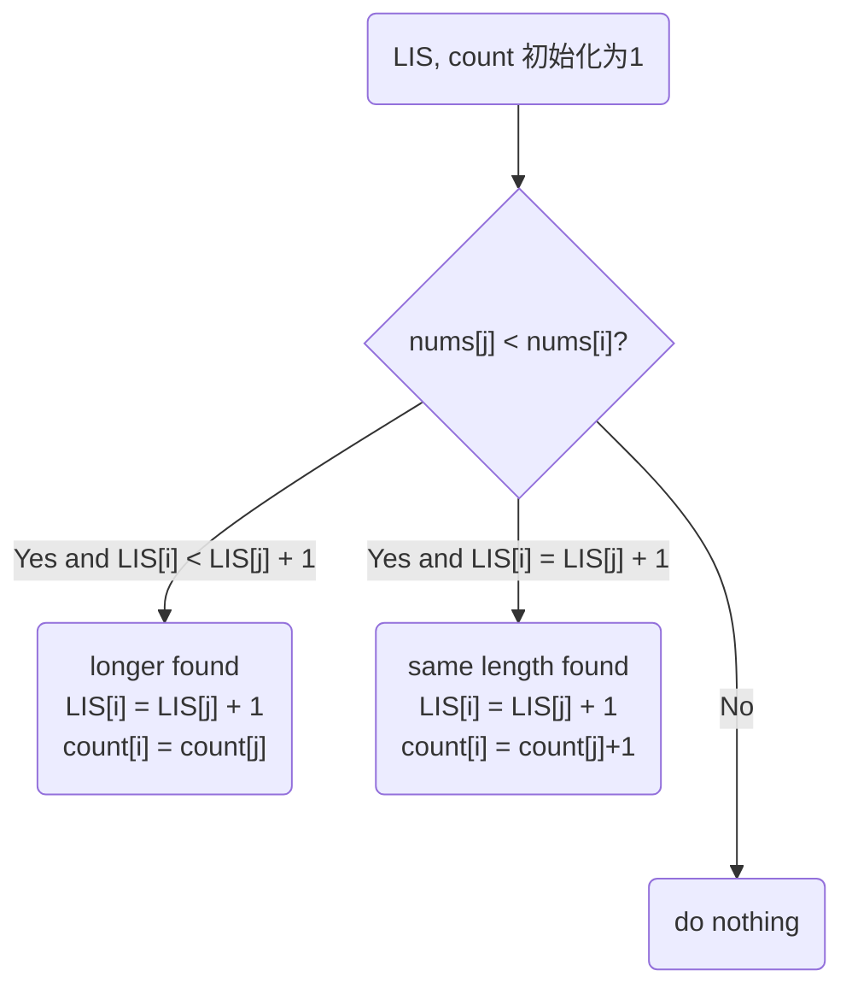

# Intuition
这一题是lis变种，subsequence problems' bottom up solution usually includes multiple indicator
- `LIS`: longest increasing sequence ending on `nums[i]`. Track longest sequence so far.
- `count`: number of LIS ending on `nums[i]`. track current longest sequence so far.


This problem has a couple of states:
- `if nums[i] > nums[j]`: Since we found an increasing sequence, we are allowed to update. How to update is based whether this new increasing sequence is longer than what we have or equal to what we have.
  - `if LIS[i] < LIS[j] + 1`: we found a longer sequence. increment `DP[i]` by one, reset `count[i]` to `count[j]`. 
    - 这里解释一下，如果`count[j]` == 1, 说明ending on `nums[j]` 的最长子序列只有一个，如果`count[j]>1`, 你得把这两个都算上. [1,2,3], on nums[2] = 3 
  - `if LIS[i] == LIS[j] + 1`: we found a sequence of same length, increment count[i] by count[j].

下面是state transition diagram:




```python
class Solution:
    def findNumberOfLIS(self, nums: List[int]) -> int:
        # LIS[i]: longest increasing sequence ending on nums[i]
        # count[i]: number of LIS ending on nums[i]
        # base case: all one
        LIS = [1 for num in nums]
        count = [1 for num in nums]

        for i in range(len(nums)):
            for j in range(i):
                if nums[i] > nums[j]:
                    if LIS[i] < LIS[j] + 1: # find a longer sequence
                        LIS[i] = LIS[j] + 1
                        count[i] = count[j]
                        continue
                        
                    if LIS[i] == LIS[j] + 1: # find another sequence with same length
                        LIS[i] = LIS[j] + 1
                        count[i] += count[j]
        # update the data 
        max_length = max(LIS)
        return sum(c for l, c in zip(LIS, count) if l == max_length)
```


