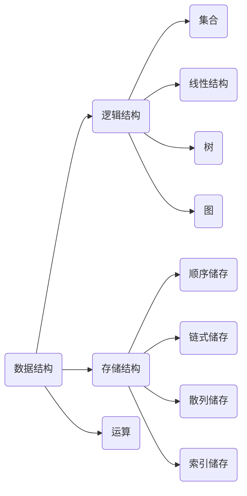

Data structure and algorithm is the bread and butter for any programmer. 如下图所示，数据结构，实际上分成三层概念，
- 基础层
  - 定义：这一层主要由`逻辑结构`和`储存结构`组成
  - 逻辑结构:数据与数据之间的关系.
  - 储存结构:在计算机中怎么储存的.
- 抽象层 Abstract Data Type (ADT)
  - 定义: 通常由一种逻辑结构+一种储存结构组成
  - 例子_1: Array: 线性结构(逻辑结构) + 顺序储存(储存结构)组成;
  - 例子_2: Singly linked: 线性结构(逻辑结构) + 链式储存(储存结构)组成;
- 实现层 Concrete Data Type (CDT)
  - 定义: 将上述的抽象出来的数据结构，具现化的过程;
  - 例子_1: Python `List()` 是一种线性+顺序的数据结构.

